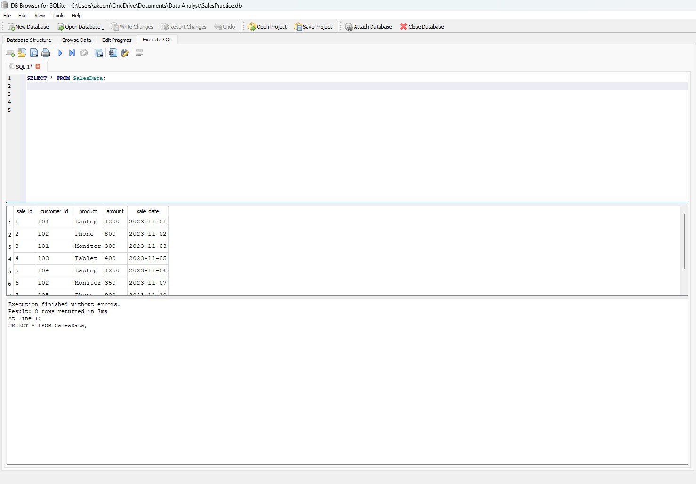
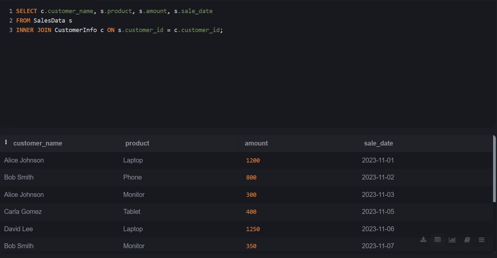
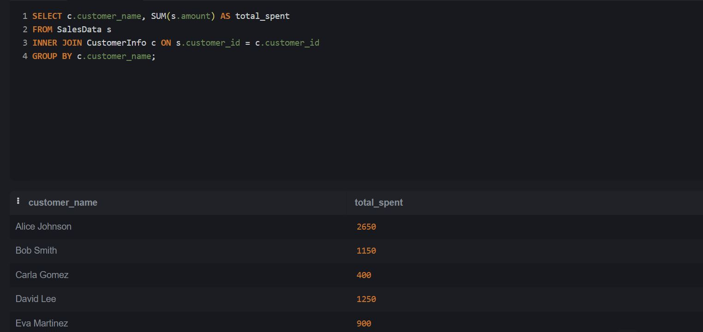
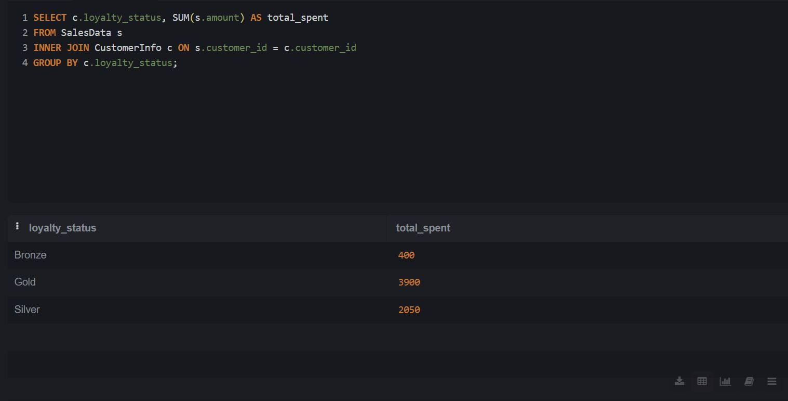
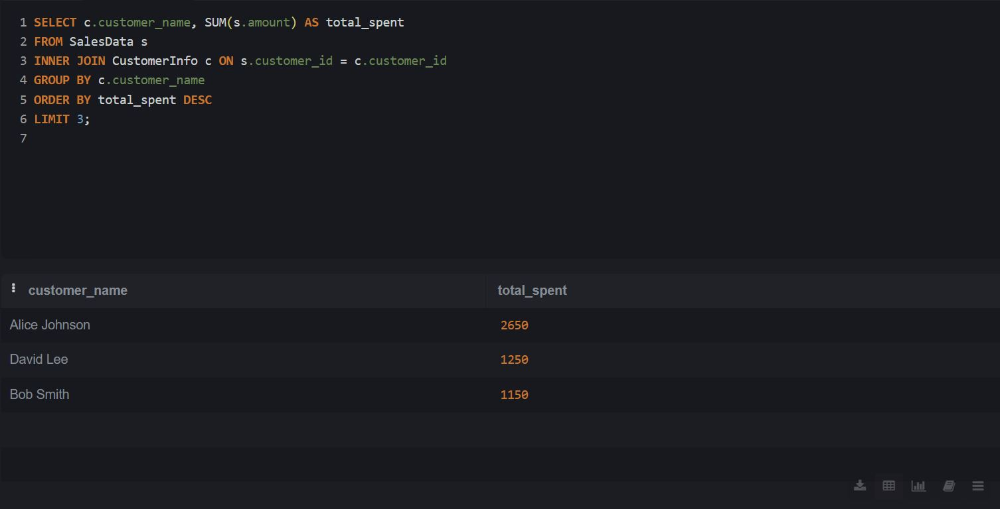
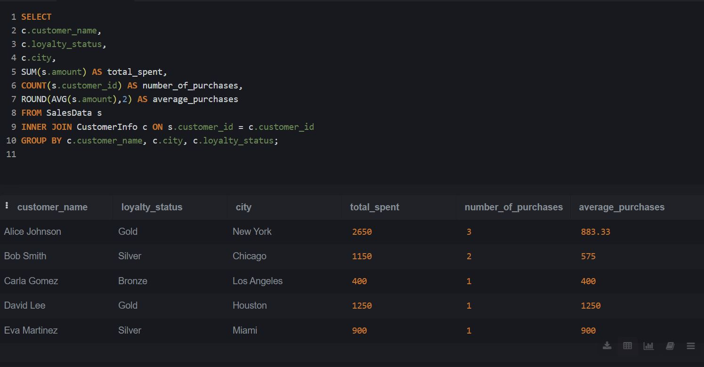

# SQL Sales Analysis


  
Mini-project analyzing fictional sales data using SQL queries to find sales trends, top products, and customer behavior patterns.

---

## 🛠️ Skills Used
- SQL (SQLite3)
- Data Analysis
- Aggregations (SUM, AVG, COUNT)
- Grouping and Sorting Data
- Filtering with WHERE Clauses

---

## 📈 Project Overview
This project focused on using SQL to analyze a simple sales dataset.  
Key tasks included:
- Calculating total revenue and average sales.
- Identifying top-selling products.
- Analyzing customer spending behavior.

The dataset included sales information such as product name, amount, customer ID, and sale date.

---

## 📂 Files Included
- `Day1_SalesData_Setup.sql` — SQL script to recreate and populate the SalesData table
- `Day1_SQL_Practice_Checklist.xlsx` — Challenge tracker to monitor learning progress
- `Day2_CustomerInfo_Setup.sql` - SQL script to recreate and populate the CustomerInfo table
- `Day2_CustomerPurchaseBehavior.sql` SQL file with queries

---

## 🚀 How to Use
1. Download the `SalesPractice.db` file or run the `Day1_SalesData_Setup.sql` script using [DB Browser for SQLite](https://sqlitebrowser.org/) or any SQL tool.
2. Explore the database by running SQL queries.
3. Replicate the practice challenges listed in the checklist.

Example query to get started:
```sql
SELECT product, SUM(amount) AS total_sales
FROM SalesData
GROUP BY product
ORDER BY total_sales DESC;
```
## 📸 Screenshots

### 1. Query: Select All Sales Data
This query retrieves all sales records from the SalesData table.


### 2. Query: Top Selling Products
This query shows the top-selling products by total sales amount.


### 3. Customer Spending Behavior
This query calculates how much each customer has spent and how many purchases they made.


### 4. Grouping - Sales by Product
Find the total sales amount per product.


### 5. Aggregation - Average Sale Amount
Find the average amount per sale.


### 6. Aggregation - Total Sales Amount
Find the total amount of all sales.


### 7. Highest Sale Amount First
Show all sales ordered by amount from highest to lowest.


### 8. Only Laptop Sales
Find sales where the product is 'Laptop'.


## 📸 Day 2 Screenshots

### Challenge 1: Customer Purchases


### Challenge 2: Total Spent per Customer


### Challenge 3: Loyalty Status Spending


### Challenge 4: High Value Sales


### Mini Project: Customer Behavior Report


